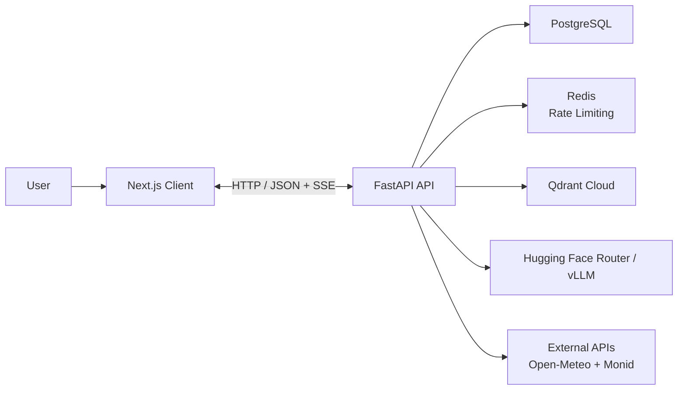
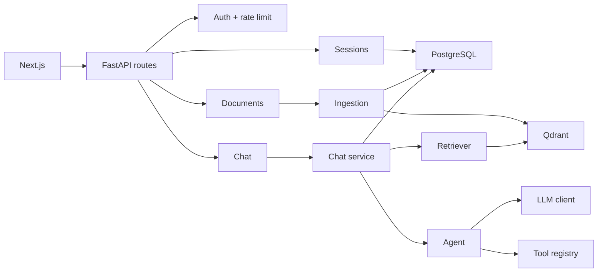
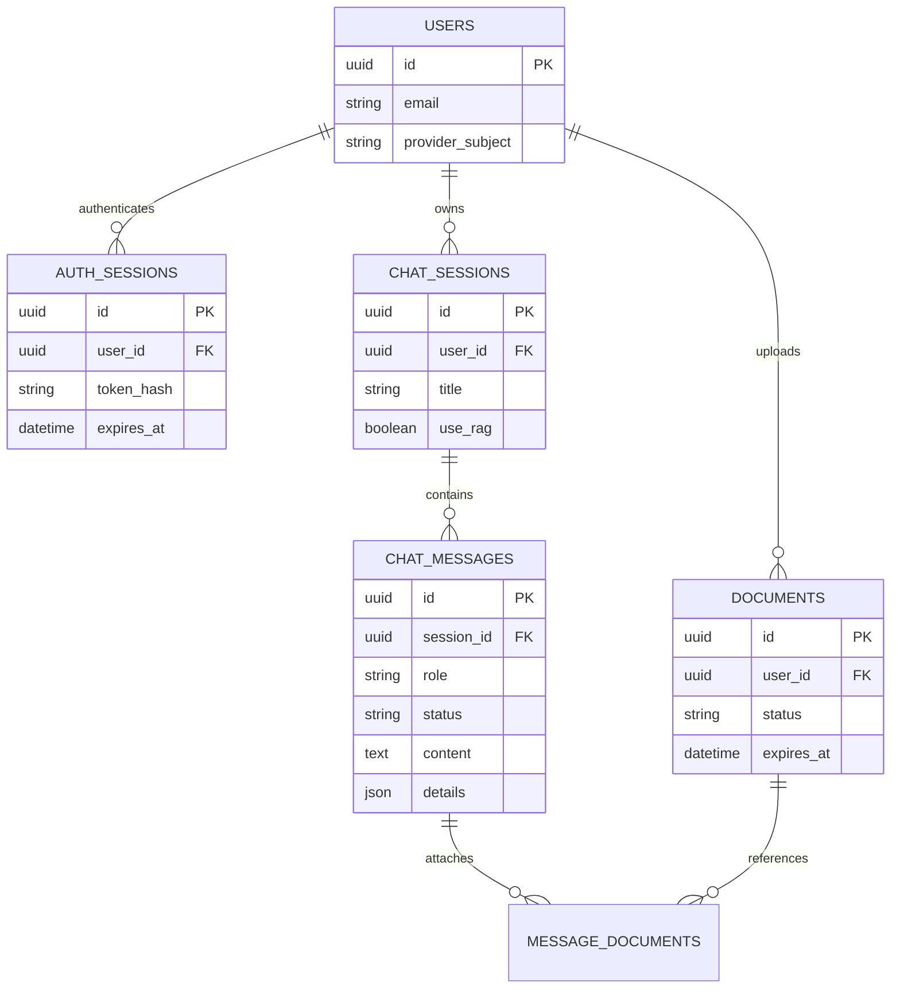
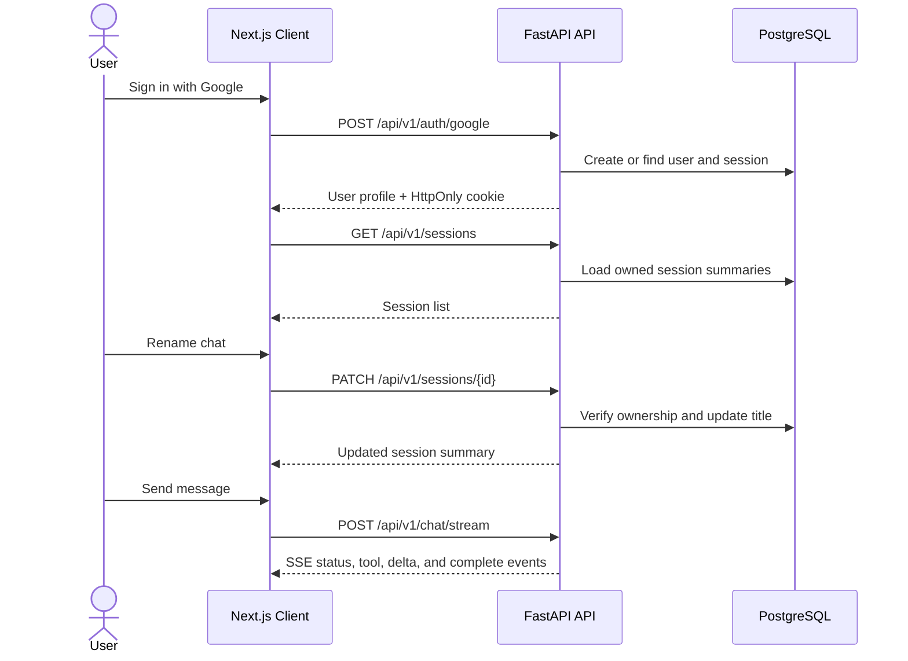
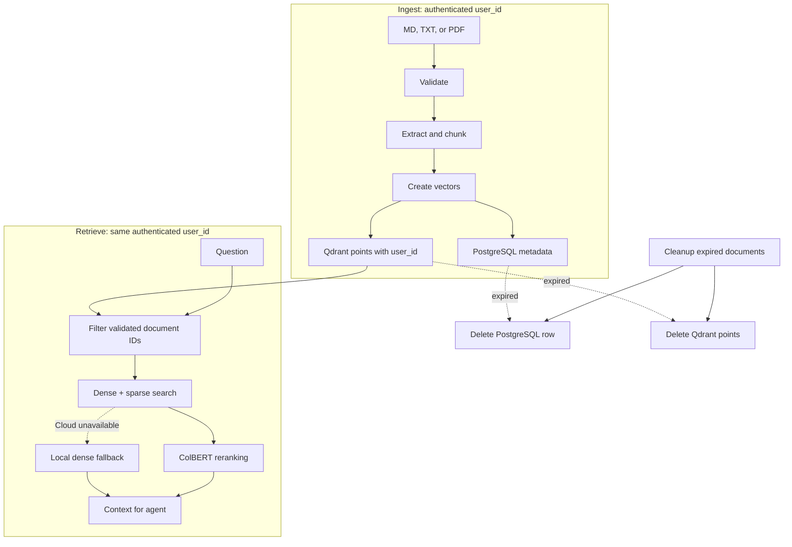
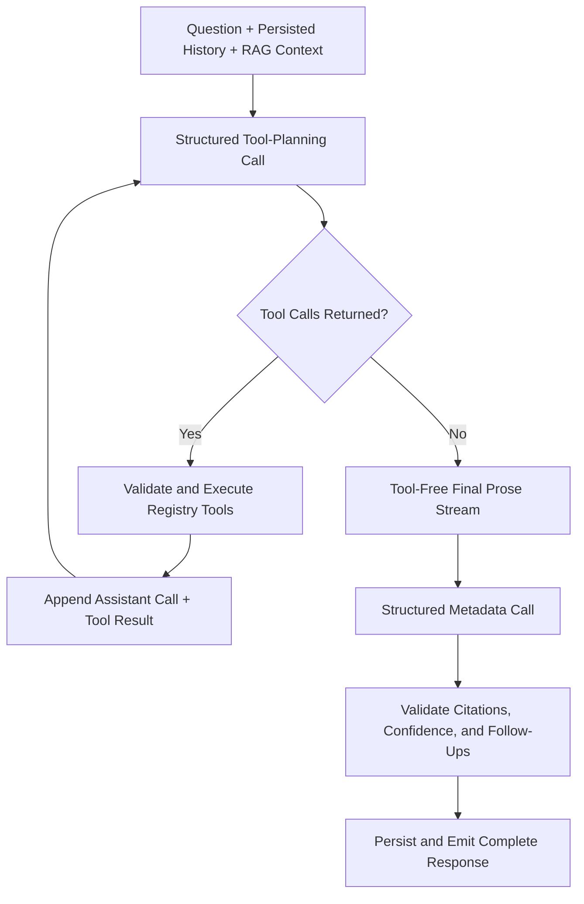
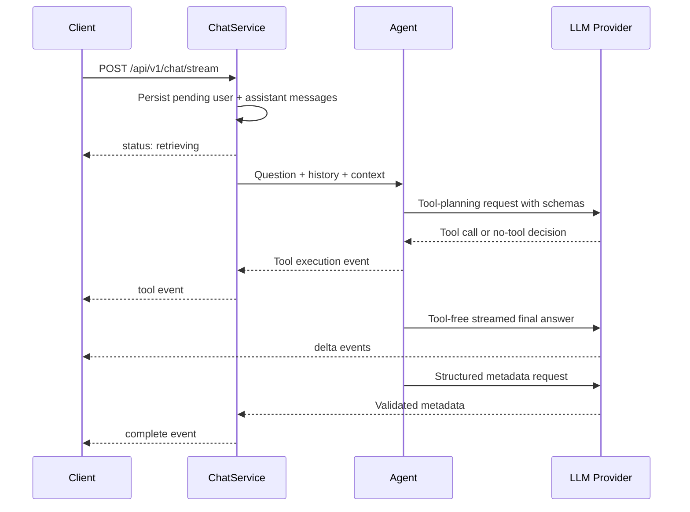
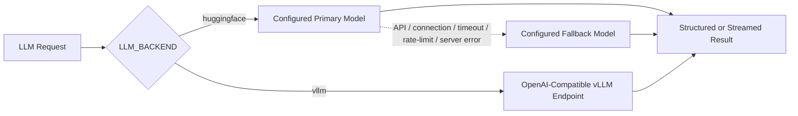
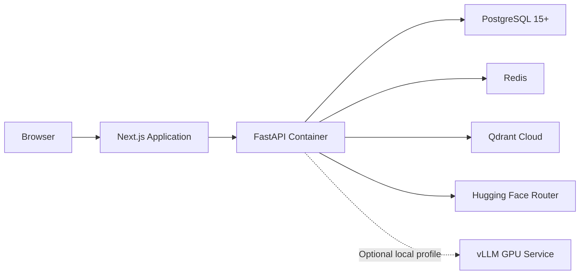

# Architecture

Engineering AI Assistant is split into a **Next.js client** and a **FastAPI API**.

The client owns interaction state and rendering. The API is the system of record for authentication, chat sessions, messages, documents, retrieval, tool execution, and model access.

## Overall System Architecture



The API uses the `/api/v1` prefix by default. Protected routes read an opaque HttpOnly application-session cookie. PostgreSQL stores only a hash of that session token, and every session, message, and document operation is scoped to the authenticated user.

Redis is used for per-user chat rate limiting:

- `CHAT_RATE_LIMIT_REQUESTS=10`
- `CHAT_RATE_LIMIT_WINDOW_SECONDS=60`

This allows a maximum of **10 chat requests per user within a 60-second window**.

---

## Runtime Components



| Component | Responsibility |
| --- | --- |
| **API routes** | Authenticate requests, apply rate limits, and map HTTP/SSE errors. |
| **Session service** | List, create, rename, read, and delete owned sessions. |
| **Chat service** | Verify ownership, load history, run RAG and the agent, then persist results. |
| **Ingestion service** | Accept `user_id`, validate files, chunk content, create vectors, and save user-scoped documents. |
| **Retriever** | Search only the authenticated user's document IDs and return ranked context. |
| **Assistant agent** | Run bounded tool-planning rounds, stream the final answer, and validate metadata. |
| **Tool registry** | Validate tool arguments and return successful or failed tool results. |
| **LLM client** | Call structured, streaming, primary, and fallback models. |
| **PostgreSQL / Qdrant / Redis** | Persist application data, store vectors, and enforce rate limits. |

The application container creates shared services at startup and closes them at shutdown. Alembic owns PostgreSQL schema changes.

---

## Data Model and Ownership



Session titles can be created, renamed, or deleted through the sessions API. Messages and document attachments are persisted with the session. PostgreSQL cascade relationships remove dependent records when an owner is deleted.

---

## Frontend Request Flow



The client loads sessions from the API, lazily loads session details, and keeps the active session in React state. It aborts the active fetch when generation is stopped. Text already received is retained, and the backend marks the assistant message as `stopped`.

---

## Document Ingestion and Retrieval



Single and batch uploads share the ingestion pipeline. Batch processing has bounded concurrency and returns an individual result for each file.

Ingestion receives the authenticated `user_id`. Documents are user-scoped, deduplicated by content hash, and assigned an expiry time. Cleanup removes the expired document row from PostgreSQL **and** its vectors from Qdrant. Setting `DOCUMENT_CLEANUP_INTERVAL_SECONDS=0` disables the periodic worker.

Retrieval uses the session's `use_rag` setting. Before querying Qdrant, the chat service verifies that every requested document belongs to the authenticated `user_id` and is attached to that user's session. The retriever receives only these validated IDs, so it cannot access another user's documents.

---

## Assistant Execution



The agent supports up to `LLM_MAX_TOOL_ITERATIONS` planner rounds. Registered tools include calculator, UTC time, weather, and Monid integrations.

The tool registry validates JSON arguments with Pydantic and converts tool failures into explicit results. This allows the model to recover from a failed tool call or choose another tool during the next planner round.

The final streamed prose request is separate from tool planning. Raw `assistant.tool_calls` and `tool` protocol messages are removed, while serialized tool results are preserved as context. This prevents an OpenAI-compatible provider from attempting another tool call in a request that does not expose tools, while still preserving retries and multiple planner rounds.

Metadata is generated after the answer stream and validated separately.

---

## Chat API and SSE Flow



`POST /api/v1/chat/stream` emits typed Server-Sent Events:

| Event | Meaning |
| --- | --- |
| `status` | Retrieval or generation progress |
| `tool` | A validated tool execution result |
| `delta` | A fragment of the final answer text |
| `complete` | Final answer, citations, tools, model, and pipeline stats |
| `error` | A recoverable request or provider failure |

The non-streaming `POST /api/v1/chat` endpoint follows the same planner and retrieval logic but returns one validated `ChatResponse`.

Redis rate limiting is enforced per authenticated user before chat processing. With the current configuration, each user can make up to **10 chat requests per 60 seconds**.

### Streaming Lifecycle

The request first passes authentication and the per-user Redis rate limit. The chat service verifies the session and document ownership, loads history, and persists pending user and assistant messages. It then retrieves context and starts the agent. During generation, the backend forwards tool results and answer chunks immediately, while accumulating the answer for persistence.

After the final text chunk, the agent makes a separate structured metadata request. Only after that metadata is valid does the service persist the complete assistant message and emit `complete`.

Each event is serialized as two SSE fields followed by a blank line:

```text
event: delta
data: {"type":"delta","content":"..."}
```

The `event` field identifies the event, while `data` contains the typed JSON payload and repeats its `type`. The frontend buffers until the blank-line boundary, normalizes line endings, parses `data`, and updates the active assistant message.

### Frontend Event Handling

The frontend sends `POST /chat/stream` with the session ID, question, and attached document IDs. It dispatches events as follows:

- `status` updates the assistant activity text and activity history.
- `tool` appends the validated execution to the assistant message's tool list.
- `delta` appends content to the visible assistant answer.
- `complete` replaces the streamed draft with the validated final answer and stores citations, confidence, follow-up questions, sources, model, and fallback status.
- `error` marks the assistant message as failed and displays the backend error.

The client uses an `AbortController` for Stop. Cancellation persists received text as `stopped`; other failures persist it as `error`. The backend emits `complete` only after answer text and metadata are valid.

---

## Model Routing and Failure Handling



The LLM client retries configured model candidates when a request fails before usable output is received. Once a streamed model emits answer content, partial output is not mixed with a fallback model.

The agent bounds tool planning using `LLM_MAX_TOOL_ITERATIONS`. The weather client performs one short retry with a timeout and User-Agent header before returning an unavailable-service error.

---

## HTTP Surface

| Method | Endpoint | Responsibility |
| --- | --- | --- |
| `GET` | `/api/v1/health` | Liveness check |
| `POST` | `/api/v1/auth/google` | Create application session from Google credential |
| `GET` | `/api/v1/auth/me` | Return authenticated user |
| `POST` | `/api/v1/auth/logout` | Revoke current application session |
| `GET, POST` | `/api/v1/sessions` | List or create owned chat sessions |
| `GET, PATCH, DELETE` | `/api/v1/sessions/{id}` | Read, rename, or delete an owned session |
| `POST` | `/api/v1/documents` | Ingest one owned document |
| `POST` | `/api/v1/documents/batch` | Ingest multiple owned documents |
| `POST` | `/api/v1/chat` | Run a complete non-streaming answer |
| `POST` | `/api/v1/chat/stream` | Stream progress and answer events |

Authentication failures are handled by authentication dependencies. Chat rate limiting is enforced with Redis per user. Domain errors become HTTP errors for the non-streaming endpoint and typed `error` SSE events for the streaming endpoint.

---

## Deployment



The normal Docker Compose setup runs the API and its dependencies without starting vLLM.

The optional `local` profile adds vLLM for a compatible NVIDIA host. A Colab GPU can expose an OpenAI-compatible vLLM endpoint through ngrok.

Configuration is loaded from `.env` using typed Pydantic settings, and secrets remain outside source control.

---

## Operational Boundaries

- **PostgreSQL** is authoritative for users, authentication sessions, chat sessions, messages, and document metadata.
- **Qdrant** stores searchable document vectors and is cleaned alongside expired document records.
- **Redis** is disposable infrastructure used for per-user rate-limit counters.
- The **frontend does not submit chat history as an authority**; the backend loads persisted history from PostgreSQL.
- Tool inputs and uploaded documents are validated before execution or storage.
- **Alembic migrations**, not application startup, change the relational schema.
- Authentication, session, message, document, and retrieval operations are always scoped to the authenticated user.
