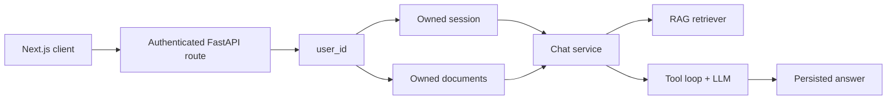

# Engineering AI Assistant Backend

A FastAPI assistant that combines retrieval-augmented generation (RAG),
structured JSON output, and external tool calling. It can use hosted models
through Hugging Face or an OpenAI-compatible model served with vLLM.

## Features

- Asynchronous FastAPI endpoints and external API clients
- Hugging Face primary and fallback models
- Optional local or remote vLLM backend
- JSON Schema-constrained assistant responses
- Multi-turn tool calling with calculator, UTC time, and live weather tools
- Markdown, text, and PDF ingestion
- Local sentence-transformer embeddings and Qdrant vector search
- Verifiable document citations in chat responses
- Redis-backed per-user chat rate limiting
- Automatic removal of expired PostgreSQL documents and Qdrant vectors
- Docker image and optional GPU vLLM Compose profile

The detailed system diagram is in [Architecture](docs/architecture.md).

## Request flow



The authenticated `user_id` is passed into session, chat, and document use
cases. It is the ownership boundary for PostgreSQL records and Qdrant points;
clients cannot select another user's sessions or documents by changing an ID.

## Project structure

```text
app/
├── api/          # HTTP routes and dependencies
├── assistant/    # Prompt construction and agent/tool loop
├── core/         # Typed settings and logging
├── llm/          # Hugging Face and vLLM-compatible client
├── rag/          # Loading, chunking, embeddings, retrieval, and Qdrant
├── schemas/      # Validated request, response, and domain models
├── services/     # Chat and ingestion use cases
└── tools/        # Tool registry and individual tool implementations
data/documents/   # Example knowledge-base documents
notebooks/        # Colab vLLM deployment
scripts/          # Command-line document ingestion
```

## Requirements

- Python 3.11 or 3.12
- PostgreSQL 15 or newer
- A Hugging Face access token, or a running vLLM endpoint
- A Qdrant Cloud cluster
- An ngrok account only when exposing vLLM from Colab

vLLM itself requires a compatible GPU for this project. It is intentionally
optional and is not started by the normal Docker Compose command.

## Local setup

From this directory, create the environment file:

```bash
cp .env.example .env
```

On Windows PowerShell:

```powershell
Copy-Item .env.example .env
```

Fill in `DATABASE_URL`, `HF_TOKEN`, `QDRANT_URL`, and `QDRANT_API_KEY`. Keep
`.env` private. Then install the application and apply its database migrations:

```bash
python -m venv .venv
source .venv/bin/activate
pip install -e ".[dev]"
alembic upgrade head
uvicorn app.main:app --reload
```

PowerShell activation uses:

```powershell
.venv\Scripts\Activate.ps1
```

Open the API documentation at <http://localhost:8000/api/docs> and check health at
<http://localhost:8000/api/v1/health>.

To run PostgreSQL through Docker while developing locally:

```bash
docker compose up -d db redis
alembic upgrade head
```

Alembic owns database schema changes. Do not create application tables with
`Base.metadata.create_all()`.

## Ingest a document

Protected endpoints use the HttpOnly session cookie created by
`POST /api/v1/auth/google`. The frontend should include credentials on every
request. The examples below assume that cookie has already been saved to
`cookies.txt`.

Upload a document through the API:

```bash
curl -X POST http://localhost:8000/api/v1/documents \
  -H "accept: application/json" \
  -b cookies.txt \
  -F "file=@data/documents/nepal_flood.md;type=text/markdown"
```

The response contains the document UUID needed when sending a chat message.
Administrators can also ingest a file for a known user directly:

```bash
python scripts/ingest_documents.py \
  data/documents/nepal_flood.md \
  --user-id USER_UUID
```

The ingestion pipeline receives the target `user_id`, validates the file,
extracts text, creates overlapping chunks, and stores both PostgreSQL metadata
and user-scoped Qdrant points. Qdrant Cloud inference performs hybrid retrieval
and reranking when available; local dense embeddings are the fallback.

Expired documents are removed from both PostgreSQL and Qdrant. The background
cleanup worker runs at startup and at the configured interval; the same bounded
operation can be run manually with the cleanup script.

## Ask a question

```bash
curl -X POST http://localhost:8000/api/v1/chat \
  -H "Content-Type: application/json" \
  -b cookies.txt \
  -d '{
    "session_id": "SESSION_UUID",
    "message": "What caused the Nepal floods? Cite the report.",
    "document_ids": ["DOCUMENT_UUID"]
  }'
```

Chat history is loaded from PostgreSQL rather than accepted from the client.
Before retrieval, the chat service verifies that requested documents belong to
the authenticated user and are attached to the user's session. The retriever
receives only those validated document IDs and cannot access another user's
documents. The response reports citations, executed tools, selected model,
fallback status, and pipeline statistics.

The agent can perform several bounded tool-planning rounds. A failed tool call
is returned as a tool result so the model can retry or choose another tool. The
final streamed answer is generated in a separate tool-free request, followed by
a structured metadata request.

## Streaming chat

`POST /api/v1/chat/stream` returns Server-Sent Events. Events are emitted in
this order as work becomes available:

| Event | Purpose |
| --- | --- |
| `status` | Retrieval or generation progress |
| `tool` | Completed tool result, including failures |
| `delta` | Incremental final answer text |
| `complete` | Validated answer, citations, tools, model, and statistics |
| `error` | Request, retrieval, or model failure |

The backend persists a pending assistant message before generation. On normal
completion it saves the final response. On cancellation it saves received text
with status `stopped`; on failure it saves received text with status `error`.
The final `complete` event is emitted only after answer metadata passes schema
validation.

## Clean up expired documents

The API checks for expired documents when it starts and then at the configured
interval. Run the same bounded cleanup manually with:

```bash
python -m scripts.cleanup_documents
```

Set `DOCUMENT_CLEANUP_INTERVAL_SECONDS=0` to disable the background worker.

## LLM backends

### Hugging Face

```env
LLM_BACKEND=huggingface
HF_MODEL=openai/gpt-oss-20b:groq
HF_FALLBACK_MODEL=deepseek-ai/DeepSeek-V4-Flash-0731:deepinfra
```

If the primary provider has an API, connection, timeout, rate-limit, or server
failure before streamed content is received, the client retries through the
configured fallback model. Partial output is never combined across models.

### vLLM on Colab

Open [the Colab notebook](notebooks/vllm_colab.ipynb), select a GPU runtime,
and add `NGROK_AUTHTOKEN` and `VLLM_API_KEY` to Colab Secrets. The notebook
starts the quantized `Qwen/Qwen2.5-14B-Instruct-AWQ` model and prints a protected
ngrok URL.

Configure the local backend using that URL and the same API key:

```env
LLM_BACKEND=vllm
VLLM_BASE_URL=https://your-ngrok-domain.ngrok-free.app/v1
VLLM_API_KEY=your-private-key
VLLM_MODEL=Qwen/Qwen2.5-14B-Instruct-AWQ
```

Restart FastAPI after changing `.env`. Stop the Colab runtime after testing;
the ngrok URL is temporary and publicly reachable, although model routes are
protected by the vLLM API key.

## Docker

Run only the API with the configured hosted backend:

```bash
docker compose up --build api
```

On a Linux machine with an NVIDIA GPU and NVIDIA Container Toolkit, run the API
and optional vLLM service:

```bash
docker compose --profile local up --build
```

Set `LLM_BACKEND=vllm` before using the local profile. The API reaches vLLM at
`http://vllm:8000/v1` inside the Compose network.

## Quality checks

```bash
ruff format --check .
ruff check .
mypy app
pytest
```

## API endpoints

| Method | Endpoint | Purpose |
| --- | --- | --- |
| `GET` | `/api/v1/health` | Application liveness check |
| `POST` | `/api/v1/auth/google` | Sign in with a Google ID credential |
| `GET` | `/api/v1/auth/me` | Return the authenticated user |
| `POST` | `/api/v1/auth/logout` | Revoke the current application session |
| `GET, POST` | `/api/v1/sessions` | List or create chat sessions |
| `GET, PATCH, DELETE` | `/api/v1/sessions/{id}` | Read, rename, or delete an owned session |
| `POST` | `/api/v1/documents` | Ingest one owned `.md`, `.txt`, or `.pdf` file |
| `POST` | `/api/v1/documents/batch` | Ingest multiple owned files |
| `POST` | `/api/v1/chat` | Run retrieval, tools, and structured generation |
| `POST` | `/api/v1/chat/stream` | Stream progress, tool calls, and answer events |

## ONNX decision

ONNX conversion is not used for the generative model. vLLM performs optimized
GPU inference using continuous batching, paged attention, and its supported
quantized model formats; converting that model to ONNX would bypass the serving
features this project is intended to demonstrate. The compact embedding model
runs locally on CPU, where ONNX could be evaluated later if profiling shows
embedding latency is a bottleneck.
