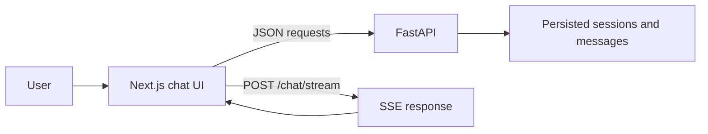

# Engineering AI Assistant Frontend

Next.js client for the FastAPI Engineering AI Assistant. It provides Google
sign-in, persistent chat sessions, document attachments, streamed answers,
tool activity, citations, Markdown, LaTeX, code highlighting, Mermaid diagrams,
chat-title editing, and toast notifications.

## How It Works



Sessions and messages are loaded from the backend, not browser local storage.
The client keeps the active session in React state and loads session messages
when a session is selected. Chat requests include the current session ID and
successfully uploaded document IDs.

### Streaming Events

The client reads the response as Server-Sent Events. Each event contains JSON
with a `type` field:

| Event | Client behavior |
| --- | --- |
| `status` | Shows retrieval or generation activity. |
| `tool` | Adds a tool execution to the assistant message. |
| `delta` | Appends answer text as it arrives. |
| `complete` | Stores the validated answer, citations, metadata, and model details. |
| `error` | Marks the assistant message as failed. |

Stop aborts the active request. Text received before cancellation remains
visible, and the backend persists the partial response as `stopped`.

### Sessions and Documents

The sidebar can create, select, rename, and delete sessions. Renaming uses
`PATCH /sessions/{id}` and shows a success toast only after the server confirms
the update. Empty titles are rejected by the editor.

Documents are uploaded before sending a message. Only documents with a ready
status are attached to the chat request; failed uploads remain visible with
their error state.

## Local Development

Create the environment file:

```powershell
Copy-Item .env.example .env
```

Configure these values:

```env
BACKEND_URL=http://localhost:8000
NEXT_PUBLIC_GOOGLE_CLIENT_ID=your-google-web-client-id
NEXT_PUBLIC_API_URL=/backend/api/v1
```

Install and start the frontend:

```powershell
yarn install
yarn dev
```

Open <http://localhost:3000>. The `/backend` rewrite proxies browser requests
to FastAPI, allowing its HttpOnly session cookie to remain first-party. The
backend must be running at `BACKEND_URL`.

## Google OAuth Configuration

Create a Web application OAuth client and add the frontend URL to its
authorized JavaScript origins:

```text
http://localhost:3000
https://your-production-domain.example
```

Use the same client ID for `NEXT_PUBLIC_GOOGLE_CLIENT_ID` in the frontend and
`GOOGLE_CLIENT_ID` in the backend.

## Verification

```powershell
yarn typecheck
yarn lint
yarn build
```

Run these commands from the frontend directory. Use `yarn dev` for local
development and `yarn start` to serve a production build.

## Docker Deployment

The backend Compose file builds the complete stack, including this frontend:

```powershell
cd ../task1-ai-assistant-backend
docker compose up -d --build
```

Before hosting, configure the backend `.env` with production credentials and:

```env
GOOGLE_CLIENT_ID=your-google-web-client-id
AUTH_COOKIE_SECURE=true
CORS_ORIGINS='["https://your-production-domain.example"]'
```

Expose the frontend on HTTPS. Keep PostgreSQL and Redis private, and avoid
exposing FastAPI publicly when all browser traffic uses the frontend rewrite.

The optional vLLM service is not started unless the `local` Compose profile is
explicitly enabled.
